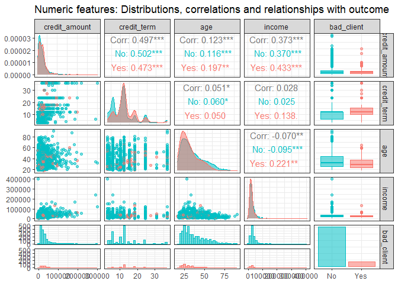
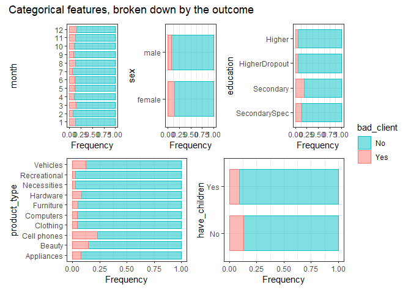
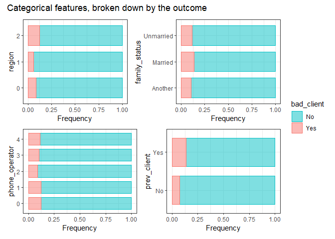
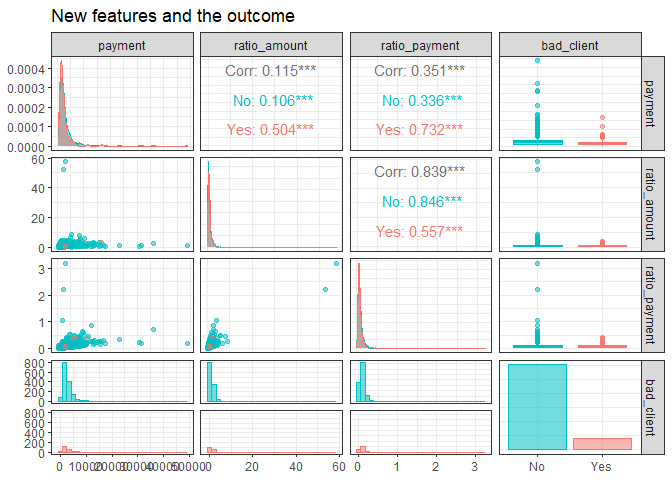
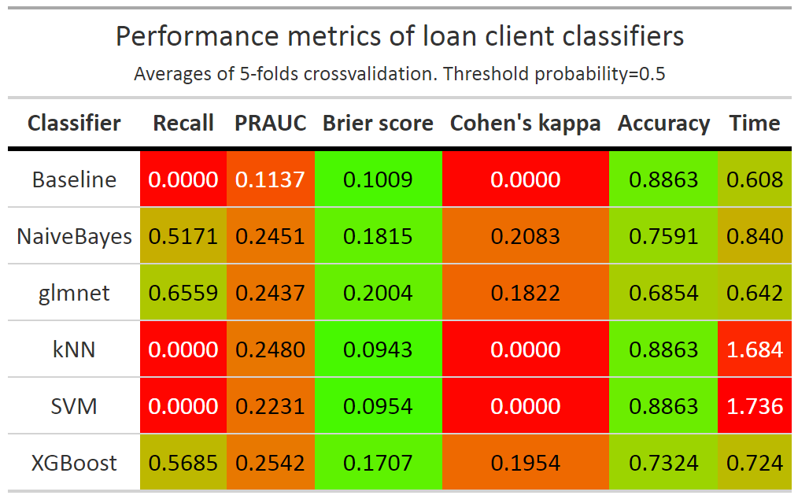
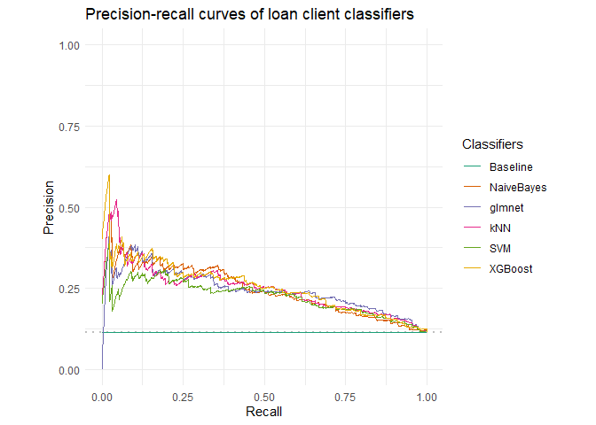

Imbalanced Classification - Loan request dataset
================
Ahmet Zamanis
2022-10-12

-   <a href="#introduction" id="toc-introduction">Introduction</a>
-   <a href="#data-preparation" id="toc-data-preparation">Data
    preparation</a>
-   <a href="#exploratory-analysis"
    id="toc-exploratory-analysis">Exploratory analysis</a>
    -   <a href="#numeric-features" id="toc-numeric-features">Numeric
        features</a>
    -   <a href="#categorical-features"
        id="toc-categorical-features">Categorical features</a>
-   <a href="#feature-engineering" id="toc-feature-engineering">Feature
    engineering</a>
    -   <a href="#creating-new-features" id="toc-creating-new-features">Creating
        new features</a>
    -   <a href="#evaluating-new-features"
        id="toc-evaluating-new-features">Evaluating new features</a>
-   <a href="#modeling" id="toc-modeling">Modeling</a>
    -   <a href="#preprocessing" id="toc-preprocessing">Preprocessing</a>
    -   <a href="#approach-to-hyperparameter-tuning"
        id="toc-approach-to-hyperparameter-tuning">Approach to hyperparameter
        tuning</a>
    -   <a href="#classifiers-with-the-best-tunes-found"
        id="toc-classifiers-with-the-best-tunes-found">Classifiers, with the
        best tunes found</a>
    -   <a href="#benchmarking" id="toc-benchmarking">Benchmarking</a>
-   <a href="#conclusions" id="toc-conclusions">Conclusions</a>

## Introduction

A common challenge in machine learning problems is classification with
class imbalanced data. Class imbalance is when the target variable we
want to classify has a very imbalanced class distribution, with the
minority class(es) making up a small fraction of all observations. A
typical example is detecting loan defaulters or credit card fraudsters,
as these will naturally make up a small minority of all customers. With
a class imbalanced problem, it is key to assess the performance of ML
models with the correct metrics. Commonly used metrics such as accuracy
can be very misleading.  
  
In this analysis, we will use a
[dataset](https://www.kaggle.com/datasets/podsyp/is-this-a-good-customer)
of loan requests by clients, and try to classify the clients / loans
into “bad” or “good” binary classes, based on features like income,
education and loan category. We will try several of the most established
classification algorithms, evaluate them with different performance
metrics, and use class weighting to try and improve performance.

## Data preparation

``` r
library(tidyverse) #data handling & ggplot2
library(GGally) #exploratory analysis
library(patchwork) #combining ggplot2 objects
library(gt) #data tables
#library(ggedit) #editing ggplot2 objects (load later as it conflicts with GGally)
library(mlr3verse) #mlr3 machine learning packages
library(mlr3hyperband) #hyperband tuning algorithm with mlr3
library(xgboost) #regularized gradient boosting
```

Let’s load our original dataset, and examine the columns.

``` r
#load and summarize original data
df <- read.csv("./OriginalData/clients.csv", header=TRUE)
summary(data.frame(unclass(df), stringsAsFactors = TRUE))
```

    ##      month        credit_amount     credit_term         age            sex     
    ##  Min.   : 1.000   Min.   :  5000   Min.   : 3.00   Min.   :18.00   female:792  
    ##  1st Qu.: 3.000   1st Qu.: 13000   1st Qu.: 6.00   1st Qu.:26.00   male  :931  
    ##  Median : 7.000   Median : 21500   Median :12.00   Median :32.00               
    ##  Mean   : 6.708   Mean   : 29265   Mean   :11.55   Mean   :35.91               
    ##  3rd Qu.:10.000   3rd Qu.: 34000   3rd Qu.:12.00   3rd Qu.:44.00               
    ##  Max.   :12.000   Max.   :301000   Max.   :36.00   Max.   :90.00               
    ##                                                                                
    ##                           education                          product_type
    ##  Higher education              :585   Cell phones                  :498  
    ##  Incomplete higher education   : 86   Household appliances         :471  
    ##  Incomplete secondary education:  5   Computers                    :178  
    ##  PhD degree                    :  3   Furniture                    :164  
    ##  Secondary education           :208   Clothing                     : 88  
    ##  Secondary special education   :836   Cosmetics and beauty services: 55  
    ##                                       (Other)                      :269  
    ##  having_children_flg     region          income         family_status 
    ##  Min.   :0.0000      Min.   :0.000   Min.   :  1000   Another  :1201  
    ##  1st Qu.:0.0000      1st Qu.:2.000   1st Qu.: 21000   Married  : 444  
    ##  Median :0.0000      Median :2.000   Median : 27000   Unmarried:  78  
    ##  Mean   :0.4283      Mean   :1.681   Mean   : 32652                   
    ##  3rd Qu.:1.0000      3rd Qu.:2.000   3rd Qu.: 38000                   
    ##  Max.   :1.0000      Max.   :2.000   Max.   :401000                   
    ##                                                                       
    ##  phone_operator    is_client      bad_client_target
    ##  Min.   :0.000   Min.   :0.0000   Min.   :0.0000   
    ##  1st Qu.:0.000   1st Qu.:0.0000   1st Qu.:0.0000   
    ##  Median :1.000   Median :1.0000   Median :0.0000   
    ##  Mean   :1.125   Mean   :0.6048   Mean   :0.1138   
    ##  3rd Qu.:2.000   3rd Qu.:1.0000   3rd Qu.:0.0000   
    ##  Max.   :4.000   Max.   :1.0000   Max.   :1.0000   
    ## 

``` r
dim.data.frame(df)
```

    ## [1] 1723   14

The dataset has 1723 rows, 13 feature columns and one target column.
There are no missing values, or columns that could be cross-checked
against one another for accuracy.

-   Our target column is bad_client_target, a binary categorical
    variable. 0 stands for “good” and 1 for “bad” client. A better way
    to think about it is “good loan request” and “bad loan request”, as
    some of the features are specific to the loan request.
-   Our categorical features are month (of the loan request), sex,
    education level, product type (loan category), whether the client
    has children, region, family status, the client’s phone operator and
    whether the client is a previous client.
-   Our numeric features are requested credit amount (in total), credit
    terms (apparently in months), age and income (presumably yearly).

First, we will rename some of the columns, and recode some of the
categorical features’ levels, for ease of coding and plotting.

``` r
#rename columns
names(df)[8] <- "have_children"
names(df)[13] <- "prev_client"
names(df)[14] <- "bad_client"
```

  
The product type column has high cardinality: There are numerous
different levels, some of them very infrequent with less than 10
observations. Estimates for very infrequent categorical levels can be
biased due to lack of observations. We will recode the infrequent
categories into more general ones, combining similar categories as much
as possible. The education column also has one infrequent level, “PhD
degree” which we’ll also recode into “Higher” education.

``` r
#recode levels of education column
df$education <- recode(df$education, "Higher education"="Higher",
                       "Incomplete higher education"="HigherDropout",
                       "Incomplete secondary education"="Secondary",
                       "PhD degree"="Higher",
                       "Secondary education"="Secondary",
                       "Secondary special education"="SecondarySpec")
```

``` r
#recode levels of product_type column, combining infrequent levels together
#new levels: Beauty, Vehicles, Necessities
df$product_type <- recode(df$product_type, 
                          "Cosmetics and beauty services" = "Beauty",
                          "Jewelry" = "Beauty",
                          "Auto" = "Vehicles",
                          "Boats" = "Vehicles",
                          "Medical services" = "Necessities",
                          "Training" = "Necessities",
                          "Childen's goods" = "Necessities"
                          )


#new level: Recreational
lookup_recreational <- tibble(old=c("Tourism", "Music", "Fishing and hunting supplies",
                                    "Sporting goods", "Audio & Video", "Fitness"),
                              new=c(rep("Recreational", 6)))
df$product_type <- recode(df$product_type, !!!deframe(lookup_recreational))


#new level: Hardware
lookup_hardware <- tibble(old=c("Windows & Doors", "Construction Materials", "Repair Services",
                                "Garden equipment"),
                              new=c(rep("Hardware", 4)))
df$product_type <- recode(df$product_type, !!!deframe(lookup_hardware))


#shorten the level Household appliances
df$product_type <- recode(df$product_type, "Household appliances"="Appliances")

#remove intermediary objects
rm(prod_types, prod_types_rare, lookup_hardware, lookup_recreational)
```

  
We’ll convert our categorical features into factors, to be used in
plotting, and later to be encoded in preprocessing. Our only ordinal
feature is education, and we’ll order its levels according to the levels
of education.

``` r
#factor convert categorical columns
#month, sex, product_type, family status, region, phone operator: 
  #factorize, don't change levels
for (i in c(1, 5, 7, 9, 11, 12)){
  df[,i] <- as.factor(df[,i])
}
rm(i)


#have children, prev_client, bad_client
  #factorize, recode levels
for (i in c(8, 13, 14)) {
  df[,i] <- recode(as.character(df[,i]),
                   "0" = "No",
                   "1" = "Yes")
  df[,i] <- as.factor(df[,i])
}
rm(i)


#education: factorize and order levels
df$education <- factor(df$education, levels=c("SecondarySpec", "Secondary",
                                              "HigherDropout", "Higher"),
                       ordered=TRUE)
```

Let’s see how the data looks with these changes.

``` r
summary(df)
```

    ##      month     credit_amount     credit_term         age            sex     
    ##  11     :174   Min.   :  5000   Min.   : 3.00   Min.   :18.00   female:792  
    ##  12     :162   1st Qu.: 13000   1st Qu.: 6.00   1st Qu.:26.00   male  :931  
    ##  10     :160   Median : 21500   Median :12.00   Median :32.00               
    ##  3      :158   Mean   : 29265   Mean   :11.55   Mean   :35.91               
    ##  7      :145   3rd Qu.: 34000   3rd Qu.:12.00   3rd Qu.:44.00               
    ##  8      :142   Max.   :301000   Max.   :36.00   Max.   :90.00               
    ##  (Other):782                                                                
    ##          education        product_type have_children region       income      
    ##  SecondarySpec:836   Cell phones:498   No :985       0: 240   Min.   :  1000  
    ##  Secondary    :213   Appliances :471   Yes:738       1:  69   1st Qu.: 21000  
    ##  HigherDropout: 86   Computers  :178                 2:1414   Median : 27000  
    ##  Higher       :588   Furniture  :164                          Mean   : 32652  
    ##                      Beauty     : 91                          3rd Qu.: 38000  
    ##                      Clothing   : 88                          Max.   :401000  
    ##                      (Other)    :233                                          
    ##    family_status  phone_operator prev_client bad_client
    ##  Another  :1201   0:536          No : 681    No :1527  
    ##  Married  : 444   1:666          Yes:1042    Yes: 196  
    ##  Unmarried:  78   2:317                                
    ##                   3:177                                
    ##                   4: 27                                
    ##                                                        
    ## 

## Exploratory analysis

We’ll perform exploratory analysis on the original features before we
engineer new features.

### Numeric features

Let’s start with our numeric features, plotting their distributions,
correlations with one another, and their relationships with the outcome.
<!-- -->  
From the histograms and density plots, we see our numeric features are
not normally distributed, but very right-tailed.

-   There is no strong correlation between the numeric features. It’s
    notable that the correlation of income with credit_term and age are
    higher for “bad” clients, though still low overall.
-   Looking at the boxplots and density plots, we see the numeric
    features except credit_term are likely not strong predictors of the
    outcome.
    -   It seems bad loan clients are generally more likely to request
        longer credit terms.
    -   Bad loan clients tend to be a little younger.
    -   The highest credit amounts seem to be awarded to good clients,
        and the highest incomes belong to good clients, but overall
        there is little difference between good and bad clients in terms
        of credit amount and income.

### Categorical features

We’ll evaluate the relationships of our categorical features with the
outcome by making mosaic plots, with each level of the categorical
feature colored by the outcome. Each bar represents the proportion of
good and bad clients in that level of the categorical feature.
<!-- -->  
Overall, our first five categorical features seem to be relevant
predictors, though to different degrees.

-   Product type / loan category seems to be a significant predictor, as
    the proportion of bad clients change considerably depending on its
    levels.
    -   Clients that request loans for cell phone purchases are almost
        25% bad clients, while the proportion is close to zero for some
        other categories.
    -   Another particularly suspect category is Beauty, which consists
        of loans for cosmetics, beauty services and jewelry.
-   There seems to be some seasonality, as bad clients make very few
    loan requests in July, and considerably more in December, likely for
    holiday shopping.
-   Bad clients are more likely to have secondary level education, and
    considerably less likely to have higher education.
-   Female clients, or clients without children, are a bit more likely
    to make bad loan requests. The effect of not having children may
    actually be caused by age, as clients without children are likely to
    be younger.

<!-- -->  
Previous clients seem to be more likely to make bad loan requests
compared to new ones.

-   The meaning of the family status level “Another” is unclear, even
    though it makes up the majority of the observations. Still,
    “Another” and “Unmarried” clients are less likely to make bad
    requests, while married clients are more likely.
-   Clients from region 2 are most likely to make bad loan requests, and
    those from region 1 are the least likely.
-   Clients who use phone operators 0 and 1 are most likely to make bad
    requests, and users of operator 2 are least likely.

## Feature engineering

The performance of machine learning algorithms greatly depend on the
quality and predictiveness of the features. If the features are not
predictive, using more sophisticated models and fine-tuning
hyperparameters likely won’t bring much improvement.  
  
Until now, it looks like the features in our dataset are not
particularly predictive of our target variable. Some of our categorical
features seem to be decently predictive of bad loan clients, while the
numerics tend to show weaker relationships, if any. Let’s see if we can
extract better features from our data.

### Creating new features

We have the total amounts, and number of payment installments requested
for the loans. We can calculate the amounts to be paid in one
installment as a possibly significant feature. We can also compute the
ratio of the loan amount to the client’s income, and the ratio of one
payment to the client’s income, as possible indicators of their
solvency.

``` r
#payment: amount to be paid in 1 payment period
df <- df %>% mutate(payment = round(credit_amount / credit_term, 0), .after=credit_term)

#ratio_amount: total amount to be paid / income
df <- df %>% mutate(ratio_amount = round(credit_amount / income, 2), .after=credit_amount)

#ratio_payment: one payment / income
df <- df %>% mutate(ratio_payment = round(payment / income, 2), .after=payment)
```

Different machine learning algorithms may benefit differently from
feature engineering.

-   For example, a linear model can’t evaluate relationships such as
    ratios or interactions, unless we directly provide them as inputs,
    so it is more likely to benefit from the features we added.
-   On the other hand, tree-based models split the data consecutively
    with different combinations of features, so they are able to
    discover relationships between features, though they may still
    benefit from having them as direct inputs.

Features such as age, income and family status are likely to interact:
The effect of one such feature on the outcome may change depending on
the other feature. We will add some interaction terms in the
preprocessing steps.

### Evaluating new features

All of our engineered features are numeric, so let’s evaluate them the
same way as our original numeric features.
<!-- -->  
Our new features’ distributions are even more right-tailed compared to
the original numeric features. We’ll apply a transformation to bring
them closer to a normal distribution in preprocessing, especially for
the sake of our Naive Bayes classifier.

-   The new features do not seem particularly predictive of bad loan
    clients either.
    -   The highest values for one loan installment, ratio of one
        installment to income, and ratio of total loan amount to income
        all belong exclusively to good loan clients. These are likely
        wealthy clients with considerable non-income assets, who are
        able to take on the biggest loans with collateral.
    -   However, this doesn’t directly help us identify bad loan
        clients. Besides for these outliers, our features take similar
        values for good and bad clients.
-   The ratio of the total loan amount to income, and the ratio of one
    payment to income are highly correlated, which is expected.
    -   Some of the classifiers we’ll use are more susceptible to
        multicollinearity, while others can tackle it better with
        regularization.
    -   We’ll keep the ratio features as they are, as they don’t seem
        completely useless. We could apply principal components analysis
        to break them up into uncorrelated PCs, but these are not
        guaranteed to be predictive like the original features.
-   Notably, the correlation of one payment with the ratio features is
    considerably higher for bad clients, while the correlation of the
    ratio features are considerably lower for bad clients.
-   Looking at the scatterplots between the features, these differences
    are likely caused by the outliers in the “good” clients category.

## Modeling

We’ll use the [mlr3 packages](https://mlr3.mlr-org.com/) to apply
preprocessing steps, classification models, resampling methods and
performance benchmarking. The use of pipelines will ensure preprocessing
steps are correctly applied, while keeping the implementation and code
much more cleaner than a manual implementation.

### Preprocessing

We have many categorical features, and we need to convert them into
numeric input for many ML algorithms. First, we can apply ordinal
encoding to the education feature manually quite easily. We don’t need
to do this separately for training and testing data, as we’d get the
same results.

``` r
#function to perform ordinal encoding on a column
encode_ordinal <- function(x, order = unique(x)) {
  x <- as.numeric(factor(x, levels = order, exclude = NULL)) - 1
  x
}

df$education <- encode_ordinal(df$education, order=levels(df$education))
```

The rest of our categorical features are nominal, with no order between
their levels. We can’t apply ordinal encoding to them, as that would
imply a non-existent order between the levels.  
  
The rest of our preprocessing will be carried out with pipe operators
combined in a pipeline, or a graph as it is called in mlr3. The
preprocessing steps, in order are:

-   Normalization of the numeric features, with a Yeo-Johnson
    transformation. This is similar to the better known Box-Cox
    transformation. Unlike Box-Cox, it also handles negative values.
-   Target encoding of nominal categorical features, specifically with
    the weight of evidence method.
    -   Target encoding methods use information from the target variable
        to encode levels of the categorical features.
    -   Weight of evidence target encoding uses the log-likelihoods of
        the target variable levels, given the levels of the categorical
        feature, to replace the categorical values with numeric values.
        It is commonly used in credit risk scoring.
-   Centering and scaling of numeric features.
-   Adding interaction terms to the model matrix.
-   Interaction terms are best calculated from centered & scaled numeric
    features, but shouldn’t be centered & scaled again afterwards.
-   Adding minority class weights, for classifiers that accept this
    parameter.
    -   Class weights determine which observations in the dataset get a
        bigger weight in the classifier’s scoring function. Errors for
        observations with higher class weight are penalized more
        heavily.
    -   The default is a weight of 1 for each observation. We can assign
        a larger class weight to the minority class observations, bad
        clients, so the model is more sensitive to mistakes for the
        minority class.
    -   A typical value for the minority class weight is calculated as
        (N. majority class obs. / N. minority class obs.).

We’ll combine these preprocessing steps into a “graph”, a pipeline that
will apply these steps in order every time we train a model. This will
ensure they are applied in the correct order. Also, the calculations for
some of these steps, especially target encoding, should only be derived
from the training data, to avoid leakage from the testing data into
model training. This is ensured by the pipeline approach.

``` r
#create preprocessing pipeline

#yeo-johnson transformation
pipe_yeo <- po("yeojohnson", standardize=FALSE)


#weight of evidence encoding
encode_woe <- po("encodeimpact")


#centering and scaling
pipe_center_scale <- po("scale")


#adding interaction terms with model matrix
pipe_interact <- po("modelmatrix", formula = ~ . + credit_amount:product_type.No +
                      credit_amount:product_type.Yes +
                      age:income + age:family_status.No + age:family_status.Yes +
                      age:have_children.No + age:have_children.Yes)


#adding minority class weights
pipe_weights <- po("classweights")
pipe_weights$param_set$values$minor_weight <- summary(df$bad_client)[1] /
  summary(df$bad_client)[2]


#create combined preprocessing pipeline (called Graph in mlr3)
graph_preproc <- pipe_yeo %>>% encode_woe %>>% pipe_center_scale %>>%
  pipe_interact %>>% pipe_weights
```

Before moving on, let’s discuss the interaction terms we added to our
model matrix:

-   Total credit amount X product type. This is likely an important
    interaction, as certain loan categories such as vehicles naturally
    warrant higher amounts, while large requests for some categories,
    such as cell phones or clothing, may be an indicator of a bad
    request.
-   Age X having children, and Age X family status. It’s likely the
    effects of being married and having children are dependent on age,
    as younger couples and parents may be less resilient financially.
-   Age X income. It’s possible the effect of age is in turn really
    caused by income, as younger people generally, but not always, tend
    to have lower income.

Let’s create the remaining mlr3 objects we need to perform our
hyperparameter tuning and performance benchmarking:

-   A classification task, which will take the input data, the class
    weights, specify the target column, and the positive class.
-   A resampling object to perform 5-folds crossvalidation.
    -   Our preprocessing pipeline will ensure the preprocessing steps
        are reapplied to every training set during crossvalidation,
        while avoiding leakage from the testing data.
-   Numerous performance metrics to tune and benchmark our models. We’ll
    discuss them in detail in the tuning and benchmarking sections.
    -   The Cohen’s Kappa metric is not normally available in
        mlr3measures, but it’s straightforward to [add custom
        measures](https://mlr3book.mlr-org.com/extending.html). I
        [added](https://github.com/AhmetZamanis/LoanRequestClassification/blob/main/mlr3CustomMeasures.R)
        Kappa, and several multiclass classification metrics, which are
        calculated by calling the package
        [yardstick](https://yardstick.tidymodels.org/).
-   Tuners with numerous hyperparameter tuning algorithms, and
    terminators to determine how many evaluations will run. We’ll
    discuss them more in the hyperparameter tuning section.

``` r
#create classification task
task_credit <- as_task_classif(df, target="bad_client", positive="Yes")


#create 5-folds resampling
resample_cv <- rsmp("cv", folds=5L)


#create performance measures
source("mlr3CustomMeasures.R") #source custom implementation of Cohen's kappa measure
measure_rec <- msr("classif.recall") 
measure_prauc <- msr("classif.prauc") 
measure_brier <- msr("classif.bbrier") 
measure_kappa <- msr("classif.kappa") 
measure_acc <- msr("classif.acc") 
measure_time <- msr("time_both")
measures_list <- c(measure_rec, measure_prauc, measure_brier, measure_kappa, 
                   measure_acc, measure_time)


#create logloss measure, just as a tuning metric
measure_log <- msr("classif.logloss")


#create tuners
tune_grid <- mlr3tuning::tnr("grid_search")
tune_random <- mlr3tuning::tnr("random_search") 
tune_hyper2 <- mlr3tuning::tnr("hyperband", eta=2) 
tune_hyper3 <- mlr3tuning::tnr("hyperband", eta=3) 
tune_anneal <- mlr3tuning::tnr("gensa") 


#create tuning terminators
term10 <- trm("evals", n_evals=10)
term25 <- trm("evals", n_evals=25)
term50 <- trm("evals", n_evals=50)
term100 <- trm("evals", n_evals=100)
term250 <- trm("evals", n_evals=250)
term500 <- trm("evals", n_evals=500)
term_none <- trm("none")
```

### Approach to hyperparameter tuning

To illustrate hyperparameter tuning with mlr3, we will go over the steps
for tuning a single learner, the regularized logistic regression model
(glmnet).

-   First, we create a “Graph learner”: The combination of our
    previously created preprocessing pipeline, and the model we want to
    apply (called learner in mlr3).
    -   We set the prediction type to “prob”, as we need class
        probability predictions for some of the performance measures
        we’ll use. We don’t set other hyperparameters yet.
-   Then we create a search space for hyperparameter tuning. For the
    glmnet model, we need to tune the parameters alpha and lambda, as a
    floating point number between 0 and 1. We’ll discuss the intuition
    behind the parameters later.
-   The parameters of the preprocessing steps are stored together with
    the parameters of the learner, so we need to write the learner
    prefix before the hyperparameters.
-   We create an Autotuner: The autotuner takes the graph learner to be
    tuned, the resampling method and performance measure to be used, the
    tuning search space, tuning algorithm and the terminator object.
-   The resampling is carried out when the autotuner is created, so we
    need to set seed before creating an autotuner if we want to use the
    same crossvalidation folds.
-   We’ll mainly use log loss as our scoring method for tuning, as it is
    the default for many models, and is affected by class weights.
    -   The only exception will be the kNN algorithm, as it doesn’t take
        class weights, and log loss may be biased because of the class
        imbalance. Instead, we’ll use the PRAUC metric, which we’ll
        discuss later.
-   In this instance, we use the simulated annealing tuning algorithm,
    which will run with 100 evaluations. One evaluation is one
    resampling (in this case, 5-folds) of one parameter configuration.
-   We train the autotuner on the classification task. This will carry
    out the hyperparameter tuning, save the archive of the tuning
    results, and apply the best found tune to the graph learner within
    the autotuner. We can extract the tuning archive as a data table to
    examine it, and set the best tune to the graph learner we previously
    created.

``` r
#create preprocessing + model pipeline (GraphLearner in mlr3)
learner_glmnet <- as_learner(graph_preproc %>>% po("learner", 
                                                   learner=lrn("classif.glmnet",
                                                   predict_type="prob")))


#create a search space for tuning
space_glmnet <- ps(
  classif.glmnet.alpha=p_dbl(lower=0, upper=1),
  classif.glmnet.lambda=p_dbl(lower=0, upper=1)
)


#create autotuner object
set.seed(1922)
autotune_glmnet = AutoTuner$new(
  learner=learner_glmnet,
  resampling=resample_cv,
  measure=measure_log,
  terminator=term100,
  tuner=tune_anneal,
  search_space=space_glmnet
)


#train autotuner object on the classification task
set.seed(1922)
with_progress(autotune_glmnet$train(task_credit))


#extract tuning results archive as data table
archive_glmnet <- as.data.table(autotune_glmnet$archive)
#best tune: alpha 0.1231044 lambda 0.04147188 logloss 0.5871771


#set graph learner parameters to best tune from autotuner
learner_glmnet$param_set$values <- autotune_glmnet$learner$param_set$values
```

There are several hyperparameter tuning algorithms available in mlr3. In
this analysis, mostly two of them were used:

-   Simulated annealing, which is used in the example above. Annealing
    was used when all the parameters to be tuned are floats, as it does
    not take integer search spaces.
    -   The simulated annealing algorithm starts similarly to a random
        search across the parameter space, trying different points
        across the range. As the search progresses, it becomes less and
        less tolerant of tunes that perform worse than previously tried
        ones.
    -   This way, the algorithm starts by considering a broad range of
        values, but quickly locks in to a narrower range likely to hold
        a good tune, if not the best. This is more effective than random
        search, without being too expensive computationally. The name
        and algorithm of the annealing method mimics the cooling process
        of metals.
-   Hyperband, which is used in the example below. Hyperband was used
    when there was more than one parameter to tune simultaneously, and
    at least one of them were integers.
    -   For the hyperband algorithm, we set one of the parameters in the
        search space as the “budget” parameter, and an eta parameter in
        the tuner object.
    -   In the example below, the budget parameter is cost, with an
        integer range of 1 to 6, and eta is 2. This means the algorithm
        will try the values 1, 3 and 6 for cost, and numerous values of
        the gamma parameter for each cost value.
    -   The number of configurations tried for each value of the budget
        parameter depends on the budget allocated for each round. See
        [here](https://mlr3book.mlr-org.com/optimization.html#hyperband)
        for a more detailed explanation of the algorithm and budget. In
        general, a larger eta means more budget is allocated for each
        round, but a narrower range of values are tried for the budget
        parameter, though the maximum is always tried.
    -   We also used transformations to set the search space in the
        example below.
        -   The search space for cost is set to integers from 1 to 6,
            but these are then transformed as 10^K, so we try 6 values
            from 10 to 1 million. This enables us to try a broad range
            of values, and we can focus on narrower ranges as necessary
            afterwards.
        -   The search space for gamma is set to integers from -8 to 2,
            transformed as 2^K, so we try values from roughly 0.004 to
            4, though most values tried are smaller than 1, which is a
            more likely range for the gamma parameter.

``` r
#create transformation functions
k_square <- function(k) {
  k <- 2^k
  k
}

k_power10 <- function(k) {
  k <- 10^k
  k
}


#create tuning space, with trafo and budget arguments
space_svm = ps(
  classif.svm.cost=p_int(1, 6, trafo=k_power10, tags="budget"),
  classif.svm.gamma=p_int(-8, 2, trafo=k_square)
)


#create autotuner object
set.seed(1922)
autotune_svm = AutoTuner$new(
  learner=learner_svm,
  resampling=resample_cv,
  measure=measure_log,
  terminator=term_none,
  tuner=tune_hyper2,
  search_space=space_svm
)
```

### Classifiers, with the best tunes found

Now, let’s discuss the classifiers we will use, the intuition behind the
algorithms and hyperparameters, and the best tunes found.

#### Naive Bayes

The first classifier we’ll use is a Naive Bayes classifier. It has no
relevant hyperparameters that need to be tuned for this problem, we just
need to set the prediction type to class probability predictions, so we
can calculate some of our performance metrics.

-   The Naive Bayes classifier relies on the Bayes Theorem to calculate
    the probabilities of the target variable, given the probabilities of
    the features. It is a relatively simple classifier that is
    computationally cheap. It does not take class weights.
-   The model is called “naive” because it assumes the features are
    unrelated to one another. This assumption will rarely hold, though
    our features don’t seem strongly dependent on one another.
-   There are different variations of the NB classifier, which make
    different assumptions about the feature distributions:
    -   Gaussian NB assumes all features are drawn from a simple
        Gaussian distribution.
    -   Bernoulli NB assumes all features are drawn from a Bernoulli
        distribution, which is a case of the binomial distribution where
        only a single trial is conducted, and the probability of success
        is either 0 or 1. In other words, it assumes the features are
        all binary. This variation is often used in text classification,
        for example if the features are whether a word occurs in a
        document or not.
    -   Multinomial NB assumes all features are drawn from a Multinomial
        distribution, which are best used when features represent counts
        or count rate. This variation is often used for text
        classification, as features can be word counts in a document.
-   We will use the standard Gaussian NB. Our numeric features were far
    from normally distributed, though we will apply a normalizing
    transformation, and NB can perform decently even when the
    assumptions are violated.
-   NB especially becomes useful for large datasets with many features,
    as more dimensions generally mean more separation, and the
    violations of the assumptions become less impactful.
-   NB generally performs better with categorical features, and it may
    perform better if we don’t encode the categorical features into
    numeric, though we’ll apply the same feature set to all models to
    make them more comparable, and to keep the workflow simple.

``` r
#Naive Bayes graph learner
learner_bayes <- as_learner(graph_preproc %>>% 
                              po("learner", 
                                 learner=lrn("classif.naive_bayes",
                                 predict_type="prob")))
```

#### glmnet

Our second classifier is a linear model: A regularized logistic
regression model, as implemented in the
[glmnet](https://cran.r-project.org/web/packages/glmnet/index.html)
package. It applies penalty terms to the loss function, to try and
reduce model complexity and avoid overfitting, especially when there is
multicollinearity between the features.

-   A penalty term is calculated from the regression coefficients, and
    applied to the loss function. This effectively “shrinks” the
    regression coefficients.
-   L1 lasso regularization adds an absolute value penalty to the loss
    function, and can shrink coefficients to zero, effectively
    performing feature selection.
-   L2 ridge regularization adds a squared value penalty to the loss
    function, without shrinking any coefficient to zero.
-   Elastic net regularization can be considered as a combination of L1
    and L2 in different ratios.
-   Besides regularization, we need to consider the regular assumptions
    of logistic regression:
    -   A binary outcome,
    -   A linear relationship between the features and the predicted log
        odds,
    -   No influential observations or outliers with extreme values.
-   We know there are some likely outliers for our numeric features, and
    it’s likely the relationships between the features and the outcome
    are not fully linear either. These may impact the performance of the
    glmnet model.
-   Multicollinearity was not a large issue to begin with, and will be
    addressed by regularization.

glmnet has two hyperparameters to tune:

-   Alpha controls the type of regularization to apply. 0 is ridge
    regularization, 1 is lasso regularization, and anything in between
    is a combination, i.e elastic net regularization.
    -   Our best tune has an alpha of roughly 0.12, so we have mostly
        ridge regularization with little chance of eliminating features
        completely from the model.
-   Lambda controls the severity of regularization, from 0 to 1. Our
    best tune has a lambda of 0.04, so it is not heavily regularized.

``` r
#glmnet graph learner
learner_glmnet <- as_learner(graph_preproc %>>% 
                               po("learner", 
                                  learner=lrn("classif.glmnet",
                                              predict_type="prob",
                                              alpha=0.1231044,
                                              lambda=0.04147188)))
```

#### kNN

The K-nearest neighbor algorithm calculates the distance of each
observation from the other observations, chooses the K closest
observations, and classifies the observation as the most frequent class
in its subset of neighbors.

-   kNN is a “lazy” algorithm: It does not perform any generalization or
    derive any rule from the training data. Instead, for each testing
    observation to be predicted, it uses the entire training data to
    make a comparison and prediction. It can be computationally
    expensive with high dimensions.
-   No parametric assumptions are made, but for useful predictions, the
    K “neighbors” closest in terms of distance must be likely to have
    the same class.
-   Multicollinearity is also likely to impact the model, by
    inflating/deflating the distances of observations.
-   All features need to be numeric to calculate distances.
    -   The distance metric is often Euclidean or Manhattan distance,
        the latter being more robust to outliers.
    -   Minkowski distance is a generalization of Euclidean and
        Manhattan, in different ratios.
-   Weighted kNN algorithms assign a weight to the votes of neighbors
    based on their distances, instead of giving one equal vote to each K
    neighbor.
-   Class weights are not applicable (not to be confused with voting
    weights, as explained above), as there is no loss function to
    penalize. kNN can be sensitive to class imbalances.

In our case, the best tune found for the number of K neighbors 129,
which is rather large compared to the size of the dataset. This is
likely because the features, and distances based on them, do not
separate good and bad clients very well, so the closest neighbors to a
bad client aren’t sufficient to classify them.

-   distance denotes the Minkowski distance paramater: 1 is Manhattan
    distance, 2 is Euclidean distance, and any value in between is a
    combination of the two. In our case, the best tune has a distance of
    1.84, closer to Euclidean distance.
-   The voting weights applied to the neighbors are calculated according
    to the “kernel” parameter. We use the default “optimal” kernel.
-   Scaling the features is necessary to avoid the impact of larger
    value ranges on the distance calculations, but we already do this in
    our preprocessing pipeline, so we set it to “FALSE” here.

``` r
#kNN graph learner
learner_knn <- as_learner(graph_preproc %>>% 
                            po("learner", 
                              learner=lrn("classif.kknn",
                              predict_type="prob",
                              kernel="optimal",
                              scale=FALSE,
                              k=129,
                              distance=1.843605)))
```

#### SVM

Support vector machine is another distance-based classifier, more
sophisticated than kNN. It calculates a distance-based decision boundary
between the two classes. The observations are then classified based on
which side of the decision boundary they fall on.

-   In general, we want the largest decision boundary with the minimum
    degree of classification error.
    -   A smaller boundary will try to create more separation (reduce
        bias), but may not be applicable to new data (overfitting).
    -   A larger boundary will create less separation (increase bias),
        but may generalize better to new data.
-   The decision boundary is normally linear, but we can use a “kernel
    trick” if the feature space is not linearly separable. Non-linear
    transformations can be applied to the features, so we can find a
    linear separator in the transformed feature space (See [this
    article](https://www.newtechdojo.com/understanding-support-vector-machines-svm/)
    for a visual demonstration of separability).
-   As with kNN, the features need to be numeric, and scaled to avoid
    the impact of large ranges on the distances. Multicollinearity is
    also likely to inflate/deflate the distances between observations
    and impact the model.
-   SVM usually generalizes well and is robust to outliers. It also
    takes class weights, and is used in imbalanced classification
    problems such as spam classification or finding loan defaulters.

In our case, we use a Gaussian radial basis function as our kernel,
which is a general-purpose non-linear kernel. We input a class weights
vector, as the SVM learner doesn’t take it from the classification task
object. We have two hyperparameters to tune:

-   cost is the cost of classification, and can be considered a
    regularization term. It takes a default value of 1, and is positive.
    -   A larger cost parameter will translate into a smaller decision
        boundary. It may reduce bias and help better separate the
        classes, but may also increase variance, leading to overfitting
        and the model not generalizing well.
    -   A smaller cost parameter will make the decision boundary larger.
        It may reduce the variance, making the model more robust. It may
        also increase bias and lead to underfitting, not separating the
        classes enough.
    -   In our case, the best tune has a cost of 10, which may indicate
        the classifier is not able to separate the classes too well.
-   gamma is a parameter for the decision boundary smoothness,
    applicable for the non-linear kernels. It takes a default value of
    (1 / data dimension).
    -   Lower gamma will increase the reach of each observation when
        calculating the decision boundary. If the boundary is dependent
        on more points farther away, it will become smoother and more
        linear. This may help make the model more robust, but may also
        lead to underfitting.
    -   Higher gamma will do the opposite, and calculate the decision
        boundary dependent on fewer, closer points. This will lead to a
        more wiggly, less linear decision boundary. This may help
        separate the classes more, but may also lead to overfitting, and
        a less robust model.
    -   In our case, the best tune has a gamma of 0.009, which indicates
        a fairly linear decision boundary.

``` r
#named class weights vector
svm_weight <- c(1, pipe_weights$param_set$values$minor_weight)
names(svm_weight) <- c("No", "Yes")


#SVM graph learner
learner_svm <- as_learner(graph_preproc %>>% po("learner", 
                                                learner=lrn("classif.svm",
                                                            type="C-classification",
                                                            class.weights=svm_weight,
                                                            predict_type="prob",
                                                            kernel="radial",
                                                            scale=FALSE,
                                                            cost=10,
                                                            gamma=0.009167361)))
```

#### XGBoost

Our final classifier is XGBoost, regularized gradient boosting with
decision trees. A single decision tree splits the data according to
sequential conditions of its features, until it arrives at a subset of
the data that is “pure” enough in terms of the outcome class, and makes
predictions using this tree of conditions. Gradient boosting is an
ensemble model, a combination of numerous sequential decision trees,
each one trained to focus on the prediction errors of the previous ones.
The XGBoost implementation also utilizes regularization parameters to
further control the tradeoff between overfitting-underfitting.

-   XGBoost is considered one of the best performing algorithms for
    tabular data, and is especially popular in data science
    competitions.
-   The model does not make strict assumptions about the data, though it
    can be less effective in certain scenarios:
    -   Tree-based algorithms learn by making splits, so they can’t
        directly learn relationships such as a linear increase/decrease.
    -   Having too many features, especially too many binary/one hot
        encoded columns can impact the model performance by making it
        harder to identify the best splits.
    -   High multicollinearity and redundancy in the features can
        obscure the feature importance scores extracted from tree
        models, if not directly impact the performance.
    -   The model has many hyperparameters that can be tuned, and may
        perform poorly with default or unsuitable configurations.
-   All features, as well as the outcome, need to be converted to
    numeric input for XGBoost. Class weights are applicable.

The XGBoost model has many parameters, and tuning can be complex. Here,
we’ll go over the main parameters and a typical approach to tuning them.

-   nrounds is the number of boosting rounds, i.e. the number of trees
    that will be trained as part of the ensemble.
    -   With too few trees, the model won’t learn enough from the data
        and underfit. With too many, the model may suffer from
        overfitting.
    -   early_stopping_rounds determines the number of rounds without a
        testing performance improvement that will stop the training
        process.
    -   The ideal number of rounds will depend on the other parameters,
        so during the tuning process, we set a very high fixed number
        for nrounds, such as 5000, and a value for early stopping such
        as 50. We will tune the other parameters with this setting, and
        find the optimal number of rounds in the end.

Holding nrounds fixed, with a value set for early_stopping rounds:

1.  Tune eta, which is the learning rate parameter. This is the
    shrinkage applied after each boosting round. eta takes a value from
    0 to 1, with a default of 0.3.

-   A lower value will make the model more robust, but will also require
    more boosting rounds.

2.  Tune the tree complexity parameters:

-   max_depth is the maximum number of splits allowed in each tree, the
    default is 6. A value of 0 means unlimited splits are allowed. More
    splits increase the risk of overfitting, but may also allow the
    model to learn more complex relationships.
-   min_child_weight can be thought of as a threshold that needs to be
    passed for a new split to be made. The default is 1, and larger
    values make the model more conservative.
-   max_delta_step is a strict tree complexity parameter that is 0 by
    default. It is suggested to try a value between 1-10 for problems
    with heavy class imbalance.

3.  Tune the regularization parameters:

-   gamma is the minimum loss reduction required for a new split. It is
    0 by default, and increasing it will increase regularization.
-   lambda is L2 ridge regularization, 1 by default, and alpha is L1
    lasso regularization, 0 by default. If both of these parameters are
    non-zero, we get a degree of elastic net regularization.

4.  Tune the randomization parameters:

-   subsample is the fraction of the observations to sample for each
    boosting round.
-   colsample_bytree is the fraction of the features to sample for each
    boosting round.
-   These parameters can be used to introduce some noise to the training
    data, to try and make the model more robust. Their default values
    are 1, meaning all observations and features are used by default.

5.  Retune eta, if the values for the other parameters changed strongly
    from their defaults.
6.  Finally, find the optimal number of nrounds for this given set of
    parameters.

-   I prefer to do this with XGBoost’s own crossvalidation function
    xgb.cv, as it gives text output of each boosting round, with the
    training errors and the testing errors.
-   Comparing the training and testing error, and observing their
    progressions across training rounds can help discover overfitting or
    underfitting issues.
-   Generally, if the training error is very close to the testing error,
    it may indicate the model is underfit, and there may be more to
    learn from the training data.
-   If the testing error is much higher from the training error, the
    model may be overfit, it may have learned information that doesn’t
    generalize.

The best tunes found in our case are available below.

-   The learning rate is low, penalizing the boosting rounds heavily.
-   In general, the model allows for more splits than usual, but
    constrains them considerably with high min_child_weight and
    max_delta_step values, as well as with the regularization
    parameters.
    -   This may indicate the features are highly independent from one
        another, so the model potentially allows many splits, but they
        are not very predictive either, so splits are only allowed if
        they bring a large improvement.
-   The randomization parameters didn’t help improve performance, so
    they are kept default.  
-   The optimal number of boosting rounds is very few at 27, despite a
    low learning rate.
    -   The training error was fairly close to the testing error in the
        xgb.cv output, and testing error quickly increases again with
        more rounds.
    -   This is possibly because the model can’t learn much from the
        features that allows it to better classify the bad clients.

``` r
#XGBoost graph learner
learner_xgb <- as_learner(graph_preproc %>>% po("learner", 
                                                learner=lrn("classif.xgboost",
                                                            booster="gbtree",
                                                            predict_type="prob",
                                                            nthread=3,
                                                            nrounds=27,
                                                            eta=0.06444704,
                                                            max_depth=12,
                                                            min_child_weight=20,
                                                            max_delta_step=8,
                                                            gamma=0.73399971,
                                                            lambda=0.9294227,
                                                            alpha=0.14594723)))
```

### Benchmarking

With the classifiers created and set to the best tunes found, let’s
benchmark their performances.

-   For comparison, we will create a baseline classifier, which will
    simply predict the class frequency for each outcome class, for all
    observations. This corresponds to a probability prediction of
    roughly 0.89 and 0.11 for good and bad clients respectively.
-   We will create a benchmark grid with our task, graph learners and
    our resampling method. We will set seed before doing this, as
    resampling will be performed upon creating the benchmark grid. We’ll
    set a different seed from the tuning process, to test our tunes on a
    different resampling iteration.
-   We’ll run the benchmark, save the results, calculate the aggregated
    values for each of our performance metrics, and retrieve this as a
    data table.

``` r
#create baseline learner
learner_baseline <- as_learner(graph_preproc %>>% 
                                 po("learner", 
                                    learner=lrn("classif.featureless",
                                    predict_type="prob",
                                    method="weighted.sample")))

  
#create benchmark grid
set.seed(1923)
benchmark_test = benchmark_grid(tasks=task_credit,
                                   learn=list(learner_baseline, learner_bayes, 
                                              learner_glmnet,
                                              learner_knn, learner_svm,
                                              learner_xgb),
                                   resamplings=resample_cv)


#perform benchmarking
set.seed(1923)
benchmarkres = benchmark(benchmark_test, store_models=TRUE)


#save average benchmarking results
benchmarkres_table <- benchmarkres$aggregate(measures_list)
```

  
Let’s make a table of the aggregated performance measures for each
classifier. The threshold probability is the default, 0.5, so any
observation with more than 0.5 estimated probability of being a bad
client is classified as such.  
  
The results overall are not good, as we expected. Let’s discuss each
performance metric.

-   Accuracy is the most commonly used, and possibly the most intuitive
    performance metric. It is simply the percentage of correctly
    classified observations.
    -   However, it can be very misleading in imbalanced classification
        problems such as ours. We see that the baseline model has an
        accuracy of almost 89%, which is quite high.
    -   In contrast, some of the classifiers including the advanced
        XGBoost algorithm have considerably lower accuracy.
    -   The classes of our outcome are heavily imbalanced, with roughly
        89% of observations being negative cases. Simply predicting all
        cases as negative is enough to get 89% accuracy, but this would
        be useless for our objective of finding bad loan clients.
        Therefore, we need to evaluate our models with other metrics.
-   Recall is the fraction of positive cases in the data that were
    correctly classified by the model as positive cases. If our priority
    is finding all bad loan requests, this is a key metric.
    -   We see that recall for the distance-based classifiers are zero,
        no different from the baseline model. They are unable to find
        any of the bad loan requests at a threshold probability of 0.5.
        This means they predict a class probability less than 0.5 for
        the positive class, for all observations, including the positive
        cases.
    -   NaiveBayes, glmnet and XGBoost are able to find more than half
        of the positive cases, which means they can be useful to a
        degree. glmnet does considerably better than the other
        classifiers, finding 66% of the positive cases at 0.5 threshold
        probability.
    -   Of course, recall by itself is not a sufficient metric. We can
        increase recall by lowering the threshold probability and
        flagging more observations as positive, at the cost of more good
        clients falsely flagged as bad. In the extreme case, a
        classifier that simply flags every observation as positive will
        achieve a recall of 1, but it will be useless.
-   PRAUC stands for area under the precision-recall curve. It is a
    measure of the tradeoff between precision and recall.
    -   Precision is the fraction of cases classified as positive, that
        were actually positive. Maximizing this is not our first
        priority, but to be useful, a model shouldn’t raise too many
        false positives while finding the bad loans.
    -   Usually, there is a tradeoff between precision and recall. We
        can increase recall by decreasing the threshold probability,
        making more positive predictions, and in turn, making more
        mistakes and lowering precision. PRAUC measures this tradeoff at
        different values of the probability threshold.
    -   PRAUC takes a value between 0 and 1. 1 would be the perfect
        classifier, which can find all positive cases, with zero false
        positives, at any threshold probability.
    -   We will understand PRAUC better when we examine the
        precision-recall curves, but we see the metric is low for all
        classifiers. This indicates our models are unable to find many
        positive cases, without flagging many false positives as well,
        though they are still an improvement over the baseline model.
-   Brier score is a measure of accuracy for the probability predictions
    themselves, unlike recall or precision which are based on the class
    predictions at a given probability threshold.
    -   For binary classification, the Brier score takes a value between
        0 and 1, 0 being no error in the predicted probabilities.
    -   Sometimes classifiers can predict classes well, even though
        their probability predictions are not very accurate. It’s a good
        idea to look at a scoring measure for probability predictions,
        such as Brier score or log loss, to identify the nuances in a
        classifier’s predictions.
        -   In our case, the distance-based classifiers seem to have the
            “best” Brier scores, while the other classifiers have
            considerably “worse” Brier scores.
        -   However, we see the baseline classifier also has a “good”
            Brier score, almost as good as the distance-based models.
        -   This is because the classes are severely imbalanced, so
            predicting bad probabilities for the minority class has a
            small impact on the score, while predicting good
            probabilities for the majority class is enough for a “good”
            score.
        -   Classifiers such as XGBoost or glmnet are focused on finding
            the positive classes rather than predicting the best
            probabilities for the negative classes, so they get “worse”
            Brier scores.
        -   Therefore, the Brier score by itself is a misleading proxy
            for the model performance in this case, though it still gave
            us insight on the models’ behavior.
-   Cohen’s Kappa coefficient can be thought of as a version of
    accuracy, but one that takes class imbalance, and the possibility of
    random chance into account.
    -   Kappa is not very intuitive or explainable, but it can be a good
        indicator of the classifier’s overall quality, regardless of
        class imbalance. It can also be used for multiclass
        classification problems without modifying the interpretation.
    -   The Kappa coefficient generally takes a value between 0 and 1,
        but theoretically it can be negative. It measures how well the
        classifier does compared to random chance predictions.
        -   Kappa of 0, or below, means the classifier is no different
            than random chance predictions, or even worse.
        -   Up to 0.2 generally means the classifier improves slightly
            over random chance.
        -   Up to 0.6-0.7 means the classifier improves considerably
            over random chance.
        -   Kappa greater than 0.6-0.7 is rare, and shows the classifier
            greatly improves over the predictions of random chance.
        -   Kappa does take class imbalance into account, but it’s
            harder to reach a Kappa coefficient much higher than 0.6-0.7
            with imbalanced data (see
            [here](https://thenewstack.io/cohens-kappa-what-it-is-when-to-use-it-and-how-to-avoid-its-pitfalls/)
            for more details on Kappa).
    -   We see the distance based classifiers have a Kappa coefficient
        of 0, just like the baseline model, while the other classifiers
        are able to reach slight improvements over random chance
        predictions.
-   Finally, the time column denotes the training and prediction time
    elapsed for each classifier. I’m not sure if the measurements are
    fully correct, though it’s clear the distance-based classifiers took
    longer to compute.

The most important performance metric here, in the context of
identifying bad loan clients, is likely PRAUC. We can plot the
precision-recall curves for each classifier, to visualize the tradeoff
between precision and recall at different threshold probabilities.  
<!-- -->  
In the plot above, the threshold probability for classifying an
observation as positive is 1 at the start of each line, and 0 at the end
of each line. This shows us how precision drops and recall increases as
the threshold probability is lowered.

-   Generally we see a linear drop in precision as recall increases.
    There are even some quirks at the start, where precision steeply
    declines, only to considerably improve again for a while.
-   In contrast, the perfect classifier is simply a straight line at
    precision 1, while a very skilled classifier would start very close
    to precision 1, and decline non-linearly as recall increases.
-   Overall, this tells us the classifiers aren’t able to skillfully
    tell apart the positive cases from the negatives.
-   Seeing improvements in precision as the threshold probability is
    lowered is peculiar. Precision is the fraction of true positives
    among cases classified as positive, so this suggests the cases with
    the highest predicted probabilities of being positive, are in fact
    mostly negatives. In other words, some of the classifiers such as
    kNN are unable to find even the most likely cases of bad clients,
    and confuse them with good clients.

## Conclusions

This report illustrated how to approach a classification problem with
severe class imbalance, the importance of using the correct performance
metrics, and evaluating their values in detail. We discussed and applied
some of the most prominent classification algorithms, and illustrated
how to tune their hyperparameters.  
  
The models performed poorly overall, but this helped us better observe
differences and nuances of several performance metrics. I believe the
poor performance is mainly due to the feature set not being predictive
enough of the outcome, as even an advanced algorithm like XGBoost
performed poorly, and comparably to simpler algorithms like Naive Bayes.
Maybe there are some performance gains left from tuning the complex
XGBoost hyperparameters more thoroughly, adding more interaction terms
to the feature set, or other creative feature engineering steps I
missed, but I doubt these will be substantial.  
  
Class imbalance, and methods to handle it seem to be a debated issue in
machine learning, with some
[suggesting](https://stats.stackexchange.com/questions/357466/are-unbalanced-datasets-problematic-and-how-does-oversampling-purport-to-he)
it is no issue at all, as long as the correct metrics are used to assess
performance, and the models are trained and tuned with proper
probability scoring methods (such as log loss) instead of measures
dependent on the threshold probability. According to some, techniques
that artificially change the dataset, such as oversampling, may do more
harm than good, such as by changing the distributions of features. Such
methods seem unintuitive for me as well, which is why they weren’t
implemented in this analysis. I find the application of class weights
intuitive, as they don’t change the input data, but simply instruct the
model to be more sensitive to errors of the minority class.  
  
Any feedback or suggestion is welcome.
